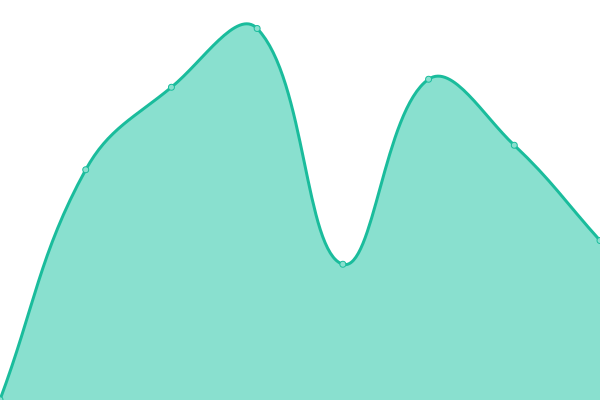

# [📈 Live Status](https://Etixen.github.io/upptime): <!--live status--> **🟧 Partial outage**

This repository contains the open-source uptime monitor and status page for [Etixen](https://Etixen.github.io/upptime), powered by [Upptime](https://github.com/upptime/upptime).

With [Upptime](https://upptime.js.org), you can get your own unlimited and free uptime monitor and status page, powered entirely by a GitHub repository. We use [Issues](https://github.com/Etixen/upptime/issues) as incident reports, [Actions](https://github.com/Etixen/upptime/actions) as uptime monitors, and [Pages](https://Etixen.github.io/upptime) for the status page.

<!--start: status pages-->
<!-- This summary is generated by Upptime (https://github.com/upptime/upptime) -->
<!-- Do not edit this manually, your changes will be overwritten -->
<!-- prettier-ignore -->
| URL | Status | History | Response Time | Uptime |
| --- | ------ | ------- | ------------- | ------ |
|  [Etixen](https://www.etixen.com) | 🟩 Up | [etixen.yml](https://github.com/Etixen/upptime/commits/HEAD/history/etixen.yml) | 

 1644ms
     
 | 

<a href="https://etixen.github.io/upptime/history/etixen">100.00%</a>
    

|  [Axiaventures](http://www.axiaventures.com) | 🟩 Up | [axiaventures.yml](https://github.com/Etixen/upptime/commits/HEAD/history/axiaventures.yml) | 

 921ms
     
 | 

<a href="https://etixen.github.io/upptime/history/axiaventures">100.00%</a>
    

|  [Diagnostico Zarate](http://www.diagnosticozarate.com.ar) | 🟩 Up | [diagnostico-zarate.yml](https://github.com/Etixen/upptime/commits/HEAD/history/diagnostico-zarate.yml) | 

 497ms
     
 | 

<a href="https://etixen.github.io/upptime/history/diagnostico-zarate">99.46%</a>
    

|  [Dillon Terzaghi](https://www.dillonterzaghi.com.ar) | 🟩 Up | [dillon-terzaghi.yml](https://github.com/Etixen/upptime/commits/HEAD/history/dillon-terzaghi.yml) | 

 327ms
     
 | 

<a href="https://etixen.github.io/upptime/history/dillon-terzaghi">100.00%</a>
    

|  [Extrutex](http://www.extrutex.com.ar) | 🟩 Up | [extrutex.yml](https://github.com/Etixen/upptime/commits/HEAD/history/extrutex.yml) | 

 404ms
     
 | 

<a href="https://etixen.github.io/upptime/history/extrutex">100.00%</a>
    

|  [Fundacion Norte y Sur](http://www.fundacionnorteysur.org.ar) | 🟩 Up | [fundacion-norte-y-sur.yml](https://github.com/Etixen/upptime/commits/HEAD/history/fundacion-norte-y-sur.yml) | 

 457ms
     
 | 

<a href="https://etixen.github.io/upptime/history/fundacion-norte-y-sur">100.00%</a>
    

|  [Ibepisa](http://ibepisa.com.ar) | 🟩 Up | [ibepisa.yml](https://github.com/Etixen/upptime/commits/HEAD/history/ibepisa.yml) | 

 247ms
     
 | 

<a href="https://etixen.github.io/upptime/history/ibepisa">100.00%</a>
    

|  [Ito-Zarate](http://www.ito-zarate.com.ar) | 🟩 Up | [ito-zarate.yml](https://github.com/Etixen/upptime/commits/HEAD/history/ito-zarate.yml) | 

 486ms
     
 | 

<a href="https://etixen.github.io/upptime/history/ito-zarate">100.00%</a>
    

|  [Lisandro Bril](https://www.lisandrobril.com) | 🟩 Up | [lisandro-bril.yml](https://github.com/Etixen/upptime/commits/HEAD/history/lisandro-bril.yml) | 

 670ms
     
 | 

<a href="https://etixen.github.io/upptime/history/lisandro-bril">99.46%</a>
    

|  [Blog de Lisandro Bril](https://blog.lisandrobril.com) | 🟩 Up | [blog-de-lisandro-bril.yml](https://github.com/Etixen/upptime/commits/HEAD/history/blog-de-lisandro-bril.yml) | 

 411ms
     
 | 

<a href="https://etixen.github.io/upptime/history/blog-de-lisandro-bril">100.00%</a>
    

|  [Watervan](http://watervan.com.ar) | 🟥 Down | [watervan.yml](https://github.com/Etixen/upptime/commits/HEAD/history/watervan.yml) | 

 245ms
     
 | 

<a href="https://etixen.github.io/upptime/history/watervan">0.00%</a>
    

|  [La Campaña Agencia](https://agencialc.com.ar) | 🟩 Up | [la-campana-agencia.yml](https://github.com/Etixen/upptime/commits/HEAD/history/la-campana-agencia.yml) | 

 610ms
     
 | 

<a href="https://etixen.github.io/upptime/history/la-campana-agencia">100.00%</a>
    

|  [Newton](https://newton.com.ar) | 🟥 Down | [newton.yml](https://github.com/Etixen/upptime/commits/HEAD/history/newton.yml) | 

 0ms
     
 | 

<a href="https://etixen.github.io/upptime/history/newton">0.00%</a>
    

<!--end: status pages-->

[**Visit our status website →**](https://Etixen.github.io/upptime)

## 📄 License

- Powered by: [Upptime](https://github.com/upptime/upptime)
- Code: [MIT](./LICENSE) © [Etixen](https://Etixen.github.io/upptime)
- Data in the `./history` directory: [Open Database License](https://opendatacommons.org/licenses/odbl/1-0/)
